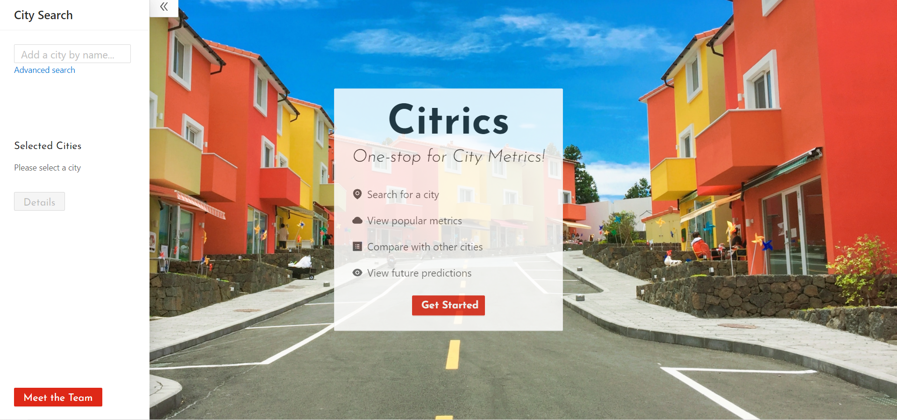
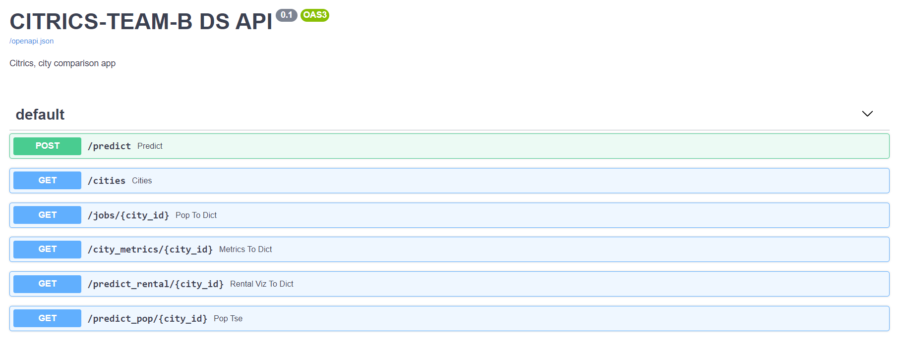

# Citrics - A city metrics app

A city metrics collation app to help find the perfect city for you!

You can find the deployed project at [Citrics Team B](https://b.citrics.dev).

### Key Features

- View useful metrics, including weather patterns, housing prices, job market, demographics, and more!
- Currently features information on the `100` largest US cities, with more to come
- Select up to three cities to compare side-by-side
- Dig into detailed historical information, trends and future predictions

#### [Walkthrough Video](https://youtu.be/ytG7onLqSOc)

#### Front end deployed to `AWS Amplify`

#### [Backend](https://b-ds.citrics.dev) built using FastAPI:


## Contributors

|                                                      [Bhavani Rajan](https://github.com/Bhavani-Rajan)                                                       |                                                       [Karl Manalo](https://github.com/karlmanalo)                                                        |                                                      [Zack Murray](https://github.com/zack-murray)                                                       |                                                       [Ekram Ahmed](https://github.com/Ekram49)                                                        |
| :-----------------------------------------------------------------------------------------------------------------------------------------: | :-------------------------------------------------------------------------------------------------------------------------------------------: | :-----------------------------------------------------------------------------------------------------------------------------------------: | :-------------------------------------------------------------------------------------------------------------------------------------------: |
| [](https://github.com/Bhavani-Rajan) | [](https://github.com/karlmanalo) | [](https://github.com/zack-murray) | [](https://github.com/Ekram49) |
|                                [ ](https://github.com/Bhavani-Rajan)                                |                            [ ](https://github.com/karlmanalo)                             |                          [ ](https://github.com/zack-murray)                           |                          [ ](https://github.com/Ekram49)                           |
|                [  ](https://www.linkedin.com/in/bhavani-rajan)                |                 [  ](https://www.linkedin.com/in/karlmanalo/)                 |                [  ](https://www.linkedin.com/in/zack-murray/)                |                 [  ](https://www.linkedin.com/in/ekram-ullah-ahmed/) 

## Project Overview

[](https://b.citrics.dev/)

- [Trello Board](https://trello.com/b/CWtzUTz0/citrics-team-b)

- [Web Frontend](https://github.com/labs26-citrics/Labs26-Citrics-FE-TeamB)

- [DS](https://github.com/labs26-citrics/Labs26-Citrics-DS-TeamB)

## Tech stack

- [AWS Elastic Beanstalk](https://docs.aws.amazon.com/elasticbeanstalk/latest/dg/Welcome.html): Platform as a service, hosts your API.
- [Docker](https://www.docker.com/blog/tag/python-env-series/): Containers, for reproducible environments.
- [FastAPI](https://fastapi.tiangolo.com/): Web framework. Like Flask, but faster, with automatic interactive docs.
- [Pandas](https://pandas.pydata.org/): Open source data analysis and manipulation tool.
- [Plotly](https://plotly.com/python/): Visualization library, for Python & JavaScript.
- [Facebook Prophet](https://facebook.github.io/prophet/): Forecasting procedure that provides completely automated forecasts.

## Datasets

[Datasets in CSV](https://github.com/labs26-citrics/Labs26-Citrics-DS-TeamB/tree/master/project/data)


# APIs

## Google Places API

We used the [Google Places API](https://developers.google.com/places/web-service/photos) to dynamically retrieve the most appropriate cover images for each city in our database.

## Backend APIs
See [Backend Documentation](https://github.com/labs26-citrics/Labs26-Citrics-DS-TeamB) for more information on the APIs used by our Data Science team.


## Getting started

[Create a new repository from this template.](https://github.com/Lambda-School-Labs/labs-ds-starter/generate)

Clone the repo
```
git clone https://github.com/YOUR-GITHUB-USERNAME/YOUR-REPO-NAME.git

cd YOUR-REPO-NAME
```

Build the Docker image
```
docker-compose build
```

Run the Docker image
```
docker-compose up
```

Go to `localhost:8000` in your browser.

<br>

<br>



<br>
<br>

There you'll see the API documentation as well as several distinct endpoints:

- An endpoint for GET requests, `/cities`: Endpoint returning list of id, cities name , their states and city_state in one string.
  
- An endpoint for GET requests, `/jobs`: Endpoint returning list and visualization of top job industries.

- An endpoint for GET requests, `/city_metrics`: Endpoint returning current city metric data for a specific city.

- An endpoint for GET requests, `/predict_rental`: Endpoint returning Return time series estimates for rents of different types of apartments over the next 5 years

- An endpoint for GET requests, `/predict_pop`: Endpoint returning time series estimates for total population over the next 5 years.

## File structure

Overall the file structure should be very intuitive and easy to follow.

`notebooks/` is where any additional notebooks used for initial data exploration, data cleaning, and the extensive data merging procedures are stored.

`project/` contains two subfolders `app/` and `data/`. `app/` contains all the api endpoints and `data/` contains all the datasets.
 

`/project/requirements.txt` is where you add Python packages that your app requires. Then run `docker-compose build` to re-build your Docker image.

```
├── Images
├── notebooks
├── project
     ├── requirements.txt
     ├── app
     |    ├── __init__.py
     |    ├── main.py
     |    ├── api
     |    │   ├── __init__.py
     |    │   ├── cities.py
     |    │   ├── current_city_metrics.py
     |    │   ├── jobs.py
     |    │   ├── pop_predict.py
     |    │   ├── population.py
     |    │   ├── predict.py
     |    │   ├── rental.py
     |    │   ├── rental_pred_viz.py
     |    │   ├── unemployment.py
     |    │   ├── viz.py
     |    │   └── weather.py
     |    └── tests
     |          ├── __init__.py
     |          ├── test_main.py
     |          ├── test_predict.py
     |          └── test_viz.py
     └── data
            


```


# Contributing

When contributing to this repository, please first discuss the change you wish to make via issue, email, or any other method with the owners of this repository before making a change.

Please note we have a [code of conduct](./CODE_OF_CONDUCT.md). Please follow it in all your interactions with the project.

## Issue/Bug Request

**If you are having an issue with the existing project code, please submit a bug report under the following guidelines:**

- Check first to see if your issue has already been reported.
- Check to see if the issue has recently been fixed by attempting to reproduce the issue using the latest master branch in the repository.
- Create a live example of the problem.
- Submit a detailed bug report including your environment & browser, steps to reproduce the issue, actual and expected outcomes, where you believe the issue is originating from, and any potential solutions you have considered.

### Feature Requests

We would love to hear from you about new features which would improve this app and further the aims of our project. Please provide as much detail and information as possible to show us why you think your new feature should be implemented.

### Pull Requests

If you have developed a patch, bug fix, or new feature that would improve this app, please submit a pull request. It is best to communicate your ideas with the developers first before investing a great deal of time into a pull request to ensure that it will mesh smoothly with the project.

Remember that this project is licensed under the MIT license, and by submitting a pull request, you agree that your work will be, too.

#### Pull Request Guidelines

- Update the README.md with details of changes to the interface, including new plist variables, exposed ports, useful file locations and container parameters.
- Ensure that your code conforms to our existing code conventions and test coverage.
- Include the relevant issue number, if applicable.
- You may merge the Pull Request in once you have the sign-off of two other developers, or if you do not have permission to do that, you may request the second reviewer to merge it for you.

## Documentation

See [Backend Documentation](https://b-ds.citrics.dev/#/) for details on the backend of our project.

# Labs DS template

[Docs](https://docs.labs.lambdaschool.com/data-science/)
